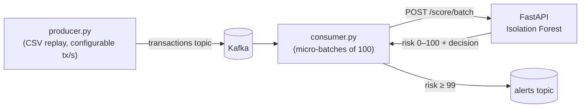
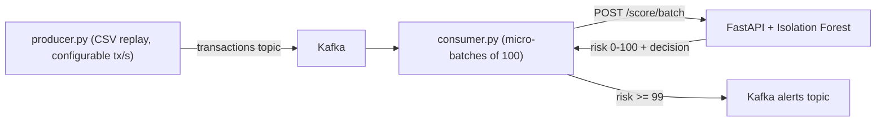

# Fraud Radar 🛰️


A **real-time fraud detection pipeline** inspired by Stripe Radar. Transactions stream through **Kafka**, are scored in micro-batches by an **unsupervised Isolation Forest** behind a **FastAPI** service, and suspicious ones are published to a dedicated alerts topic.

Built and evaluated on the **Kaggle credit card fraud dataset** (284,807 real transactions, 0.17% fraud). The project focuses on the two problems that make production fraud detection hard: **extreme class imbalance** and **choosing an operating point with asymmetric business costs** — not just model training.

---

## Demo


---

## System Architecture

Stateless scoring service behind a streaming pipeline — the scorer can be replicated independently of producers and consumers.



### Key Components

* **Kafka (KRaft, single-node via Docker Compose)**
  Decouples transaction producers from scoring. Absorbs traffic bursts, allows replay, and lets multiple consumers process the same stream. Alerts are published to a separate topic so downstream systems (case management, analyst dashboards) subscribe independently.

* **Consumer / Scorer (Python)**
  Polls the transactions topic and scores in **micro-batches of 100** via `/score/batch` instead of one HTTP call per message. At ~15 ms per round trip, per-message scoring caps out near 65 tx/s; batching multiplies throughput ~50× at negligible added latency.

* **Scoring API (FastAPI + scikit-learn)**
  Loads model artifacts once at startup. Exposes `/score`, `/score/batch` (limit 1,000), and `/health`. Pydantic validates the 28-feature vector and amount on every request.

* **Isolation Forest (unsupervised)**
  Trained without labels — mirroring production fraud, where chargeback labels arrive weeks late. Labels in the dataset are used **only** for offline evaluation and the live true/false-positive tally.

---

## How Scoring Works

* **Anomaly detection, not classification.** Isolation Forest isolates points via random splits; anomalies need fewer splits (shorter average path length), yielding higher anomaly scores.

* **Percentile calibration.** Raw `decision_function` output (e.g. `-0.043`) is unusable for thresholding. Scores are converted to a 0–100 **risk score** — the percentile among normal training traffic. *Risk 99 literally means "more anomalous than 99% of legitimate transactions."*

* **Decision policy:** risk ≥ 99 → `review` (human analyst), risk ≥ 99.9 → `block` (auto-decline), else `approve`.

---

## Results

### Offline evaluation (Kaggle creditcard dataset, 30% held-out test split)

| Metric | Value |
|--------|------:|
| AUROC | **0.9474** |
| Average Precision | 0.1781 |
| Test fraud count | 148 |
| Test set size | 85,443 |

AUROC ~0.95 with AP ~0.18 is the expected profile for a purely unsupervised detector on this dataset: the model **ranks** fraud well, but precision at the top of the ranking is limited because real fraud overlaps normal behavior (card-testing charges look like coffee purchases).

### Live streaming run (40,000 transactions replayed through Kafka at 200 tx/s)

| Metric | Value |
|--------|------:|
| True positives (fraud caught) | 150 |
| False positives | 490 |
| Alert precision | **23.4%** |
| Alert rate | **1.6%** of traffic |
| Batch scoring latency | 14–25 ms per micro-batch |
| Consumer group lag after run | **0** |

Consumer lag of 0 (verified via `kafka-consumer-groups.sh`) confirms the scorer sustained the full 200 tx/s producer rate without falling behind.

---

## Performance Analysis: Choosing the Operating Point

The first end-to-end run exposed the most important lesson in the project.

With the initial thresholds (`review` at risk ≥ 90), the system flagged **~8% of all traffic** — by construction, since the risk score is a percentile of normal traffic. At real payment volumes, no review team can inspect 8% of transactions. The model was ranking well; the **operating point** was wrong.

### Root Cause

> Threshold selection is a **business decision with asymmetric costs**, not a statistical one.

* A false `review` costs analyst time — recoverable.
* A false `block` auto-declines a legitimate customer — lost revenue, support calls, churn.

### Resolution

Thresholds were retuned to `review ≥ 99` (~1% of traffic routed to human review) and `block ≥ 99.9` (auto-decline reserved for the top 0.1% of anomaly scores, where confidence is highest). This cut the alert rate from ~8% to **1.6%** while keeping alert precision at 23.4% — a review queue a real team could actually work.

### Known Limitations

* **Recall gap:** some real fraud scores low — small card-testing charges are statistically indistinguishable from normal purchases to a pure anomaly detector. Production systems layer supervised models on top once labels mature.
* **No drift detection:** fraud patterns evolve; live score distributions should be monitored against training (e.g. KS test) to trigger retraining.
* **PCA features:** the dataset's anonymized components mean no human-interpretable explanations for analysts.
* **At-least-once delivery:** a consumer crash mid-batch can re-score messages after rebalance — safe here because scoring is idempotent, but duplicate alerts are possible.

---

## Quickstart

```bash
pip install -r requirements.txt

# 1. Data — synthetic (runs out of the box)
python data/generate_synthetic.py --rows 50000

#    ...or the real Kaggle dataset (what the results above use):
#    download creditcard.csv from kaggle.com/datasets/mlg-ulb/creditcardfraud
#    and save it as data/transactions.csv — same schema, zero code changes.

# 2. Train
python training/train.py --data data/transactions.csv --out models/

# 3. Serve
uvicorn app.main:app --port 8000
```

Interactive API docs at `http://localhost:8000/docs`, or:

```bash
curl -s http://localhost:8000/health
curl -s -X POST http://localhost:8000/score \
  -H 'Content-Type: application/json' \
  -d '{"transaction_id":"txn_1","features":[0,0,0,0,0,0,0,0,0,0,0,0,0,0,0,0,0,0,0,0,0,0,0,0,0,0,0,0],"amount":42.50}'
```

## Real-Time Streaming

```bash
docker compose up -d kafka        # single-node Kafka (KRaft, no Zookeeper)

# terminal 1 — API
uvicorn app.main:app --port 8000

# terminal 2 — consumer/scorer
python streaming/consumer.py --batch-size 100

# terminal 3 — replay transactions
python streaming/producer.py --rate 200 --limit 20000
```

The consumer prints a running tally (scored / review / block / tp / fp) and publishes every flagged transaction to the `alerts` topic. Verify directly inside Kafka:

```bash
# read raw alerts off the topic
docker exec fraud-radar-kafka /opt/kafka/bin/kafka-console-consumer.sh \
  --bootstrap-server localhost:9092 --topic alerts --from-beginning --max-messages 5

# consumer group lag (LAG 0 = scorer keeping pace with producers)
docker exec fraud-radar-kafka /opt/kafka/bin/kafka-consumer-groups.sh \
  --bootstrap-server localhost:9092 --describe --group fraud-scorer
```

## Tests & CI

```bash
pip install -r requirements-dev.txt
pytest -q        # trains a small fixture model in a temp dir — no dataset needed
ruff check .
```

GitHub Actions runs lint + the full test suite on every push.

---

## Scaling Strategy

* **Partition the transactions topic** and add consumers to the `fraud-scorer` group — Kafka distributes partitions across instances automatically.
* **Replicate the stateless API** behind a load balancer, or move the model **in-process** in the consumer to eliminate the HTTP hop entirely.
* **Monitor consumer lag** as the saturation signal: a growing LAG column means the scorer needs more capacity.

## Future Improvements

* Autoencoder scorer behind the same endpoint; A/B the two models via a `model` query param
* Drift-detection endpoint comparing live score distributions to training (KS test)
* Prometheus metrics + Grafana dashboard for scores/sec and alert rates
* Supervised second-stage model trained on matured labels to lift alert precision

---

## Conclusion

This project demonstrates:

* Unsupervised anomaly detection under **extreme class imbalance** (0.17% positives)
* Turning raw model output into **calibrated, explainable risk scores**
* **Operating-point selection driven by business cost asymmetry**, validated on a live stream
* Streaming systems fundamentals — micro-batching for throughput, consumer groups, offset management, and lag as a capacity signal

The deliberately surfaced tradeoff: an unsupervised detector alone ranks fraud well (AUROC 0.95) but cannot reach review-queue precision by itself (AP 0.18) — which is exactly why production systems like Stripe Radar layer supervised models on top.
