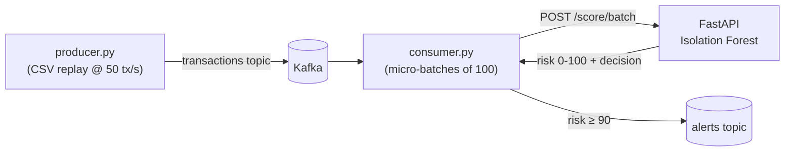

# Fraud Radar 🛰️


Real-time transaction fraud scoring, inspired by Stripe Radar. Transactions stream through Kafka, get scored by an Isolation Forest behind a FastAPI service, and suspicious ones are published to an alerts topic.


## Demo


## How scoring works

- **Model**: Isolation Forest, trained unsupervised on (mostly) normal traffic. Anomalies get isolated in fewer random splits, producing higher anomaly scores. Labels are used only for offline evaluation — mirroring reality, where fraud labels arrive weeks late via chargebacks.
- **Calibration**: sklearn's raw `decision_function` output is hard to threshold. We convert it to a 0–100 **risk score** = the percentile of that score among normal training traffic. Risk 99 literally means "more anomalous than 99% of legit transactions."
- **Decisions**: risk ≥ 90 → `review`, risk ≥ 99 → `block`, else `approve`.
- **Throughput**: the consumer micro-batches (default 100) into `/score/batch` instead of one call per message — ~50x throughput at negligible added latency.

## Quickstart

```bash
pip install -r requirements.txt

# 1. Data — synthetic (runs out of the box)
python data/generate_synthetic.py --rows 50000

#    ...or the real Kaggle dataset (recommended for the portfolio version):
#    download creditcard.csv from kaggle.com/datasets/mlg-ulb/creditcardfraud
#    and save it as data/transactions.csv — same schema, zero code changes.

# 2. Train
python training/train.py --data data/transactions.csv --out models/

# 3. Serve
uvicorn app.main:app --port 8000
```

Test it:

```bash
curl -s http://localhost:8000/health
curl -s -X POST http://localhost:8000/score \
  -H 'Content-Type: application/json' \
  -d '{"transaction_id":"txn_1","features":[0,0,0,0,0,0,0,0,0,0,0,0,0,0,0,0,0,0,0,0,0,0,0,0,0,0,0,0],"amount":42.50}'
```

## Real-time streaming

```bash
docker compose up -d              # single-node Kafka (KRaft, no Zookeeper)

# terminal 1 — API
uvicorn app.main:app --port 8000

# terminal 2 — consumer/scorer
python streaming/consumer.py --batch-size 100

# terminal 3 — replay transactions at 50/sec
python streaming/producer.py --rate 50
```

The consumer prints running stats (scored / flagged / true-positive / false-positive) and pushes every `review`/`block` decision to the `alerts` topic:

```bash
docker exec fraud-radar-kafka /opt/kafka/bin/kafka-console-consumer.sh \
  --bootstrap-server localhost:9092 --topic alerts --from-beginning
```

## Tests & CI

```bash
pip install -r requirements-dev.txt
pytest -q        # trains a small fixture model in a temp dir — no dataset needed
ruff check .
```

CI (GitHub Actions) runs lint + tests on every push.


## Results (Kaggle creditcard dataset, 284,807 transactions, 0.17% fraud)

| Metric | Value |
|--------|------:|
| AUROC | 0.9474 |
| Average Precision | 0.1781 |
| Suggested Risk Threshold | 95.0 |
| Test Fraud Count | 148 |
| Test Size | 85,443 |

## Ideas to extend

- Autoencoder scorer (PyTorch) behind the same endpoint; A/B the two models via a `model` query param
- Threshold tuning endpoint driven by a precision/recall budget
- Prometheus metrics + Grafana dashboard for scores-per-second and alert rates
- Feature drift detection: alert when live score distribution diverges from training (KS test)
